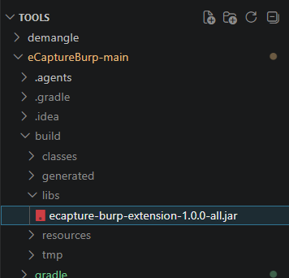
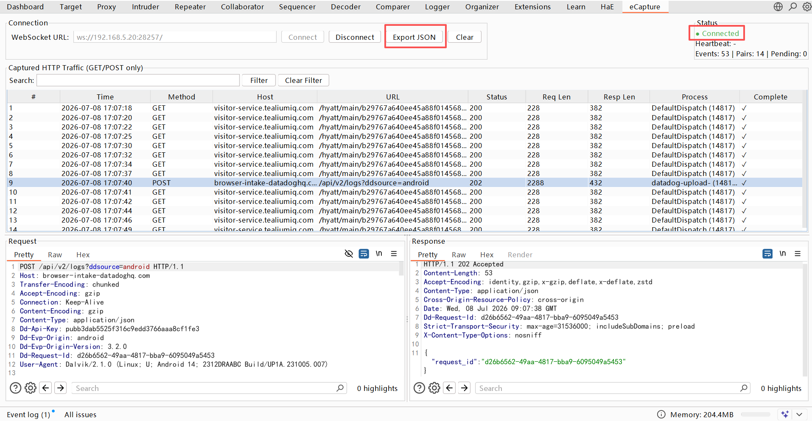
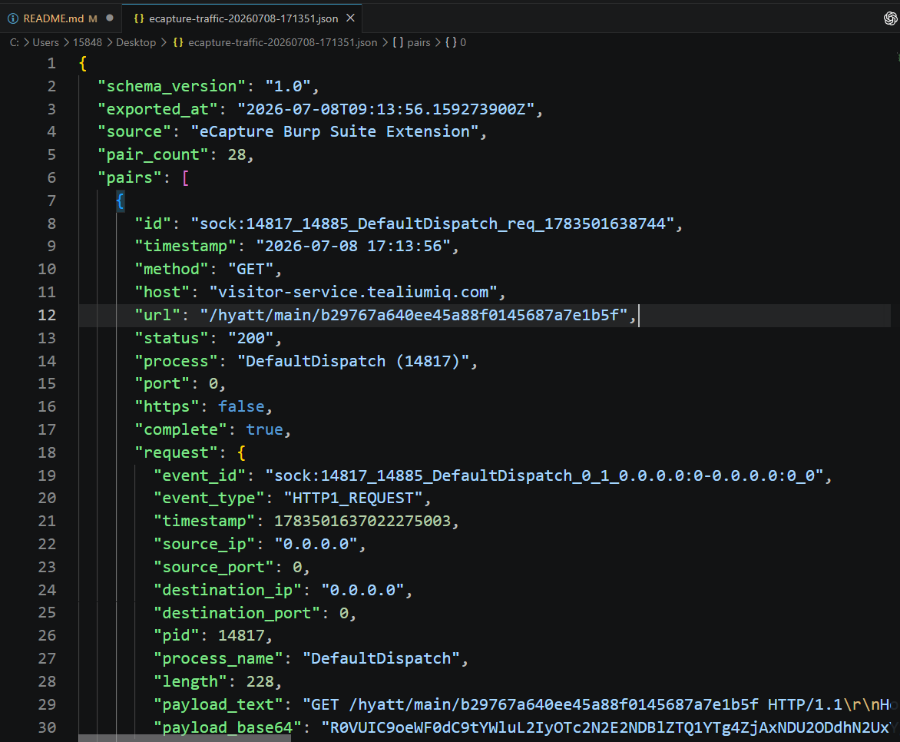

# 项目简介
1. 本项目旨在提供一套实用的工具集，帮助安全研究人员和开发者更高效地进行逆向工程、调试和安全分析工作。
2. 目前包含以下功能模块：
   - 批量Demangle处理脚本：用于将C++函数名从混淆状态转换为可读状态，方便分析和调试。
   - Hook指令处理工具集：提供一系列工具，用于生成Hook指令、去重等操作，简化Hook过程。
   - RPC + Socket自吐 + 在电脑端输出抓包内容：实现RPC通信和Socket自吐功能，并在电脑端输出抓包内容，便于实时监控和分析。

<br><br>

# 目录

- [1. 批量Demangle处理脚本](#demangle)
- [2. Hook指令处理工具集](#hook-tools)
- [3. RPC + Socket自吐 + 在电脑端输出抓包内容](#rpc-socket)
- [4. eCapture抓包Burp插件](#ecapture)


<br><br>

<a id="demangle"></a>
# 1. 批量Demangle处理脚本

使用方法：

    demangle文件夹下，

    python demangle_exports.py exports.json


<br>
exports.json是  objection将so文件的导出函数列表导出为json格式后的文件，命令如下：

```
memory list exports libexample.so --json exports.json
```


<br>

效果如下：


<br><br>

<a id="hook-tools"></a>
# 2. Hook指令处理工具集(去重、Hook指令生成等)

使用方法：

    hook_tools文件夹下，

    打开android_hook_tool.html文件，即可使用    

<br>


#### Hook类指令(objection)


<br>

#### 去重


<br><br>

<a id="rpc-socket"></a>
# 3. RPC +Socket自吐 + 在电脑端输出抓包内容


使用方法：

    socket 文件夹下，运行
    python hook_receive_socket.py
    Roysue_socket_send.js和hook_receive_socket.py配合使用

<br>
效果如下：


<br>

<a id="ecapture"></a>

# 4. eCapture抓包Burp插件

## Build

1. 如果要自己编译

```bash
用Idea打开eCaptureBurp-main文件夹下，打开Bash终端，执行

./gradlew clean shadowJar

检查编译结果

ls build/libs
jar tf build/libs/*all*.jar | grep java_websocket

- 如果遇到报错，可以让AI帮忙进行检查
```

2. 如果不想自己编译，直接下载编译好的jar包，放到Burp的Extensions中即可.



<br>

##  Usage

### 1. Start eCapture

```bash
sudo ./ecapture tls --ecaptureq=ws://0.0.0.0:28257 -p <pidof process> 
```

### 2. Connect in Burp Suite

1. 输入 WebSocket URL (`ws://<ip of phone> :28257/`)
2. 点击 **Connect** 按钮
3. 绿色的 **Connected** 状态表示连接成功
4. 点击 **Export JSON** 按钮保存抓包结果为 JSON 文件


效果如下：






本工具参考的是zitoxxx的[eCapture Burp Suite Extension](https://github.com/zitoxxx/eCaptureBurp)项目，增加了导出JSON功能，并且修复了build的一些bug，方便在Burp中使用。


<br>


# 后续
工具后续会继续完善和增加功能，敬请期待！欢迎大家提出意见和建议！