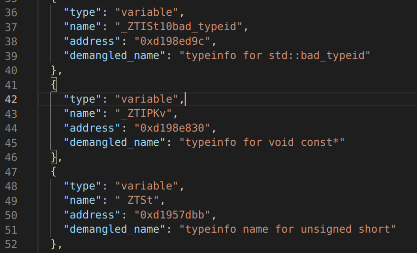
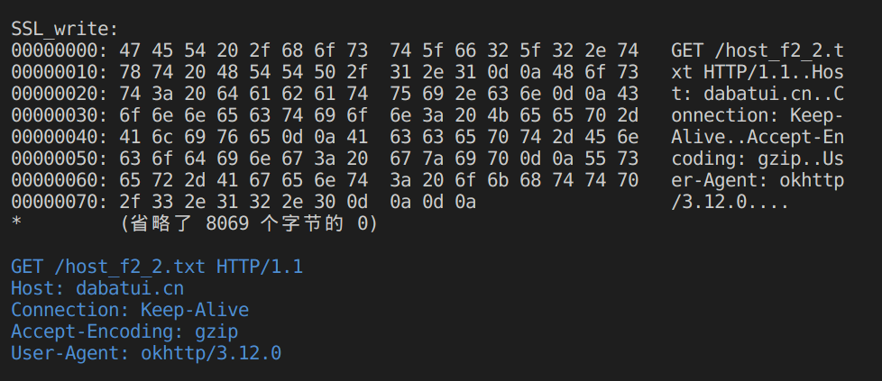

# 目前的工具


##  1. 批量Demangle处理脚本demangle_exports.py

使用方法：python demangle_exports.py exports.json
    

exports.json是  objection

```
memory list exports libmynativeapplication1.so --json exports.json
```

的结果


效果如下：





##  2. 文本处理工具集  android_hook_tool.html

    使用方法：打开android_hook_tool.html文件，即可使用    


效果如下：


## 3. RPC +Socket自吐+在电脑端输出抓包内容  hook_receive_socket.py

    使用方法：python hook_receive_socket.py
    Roysue_socket_send.js和hook_receive_socket.py配合使用


效果如下：

