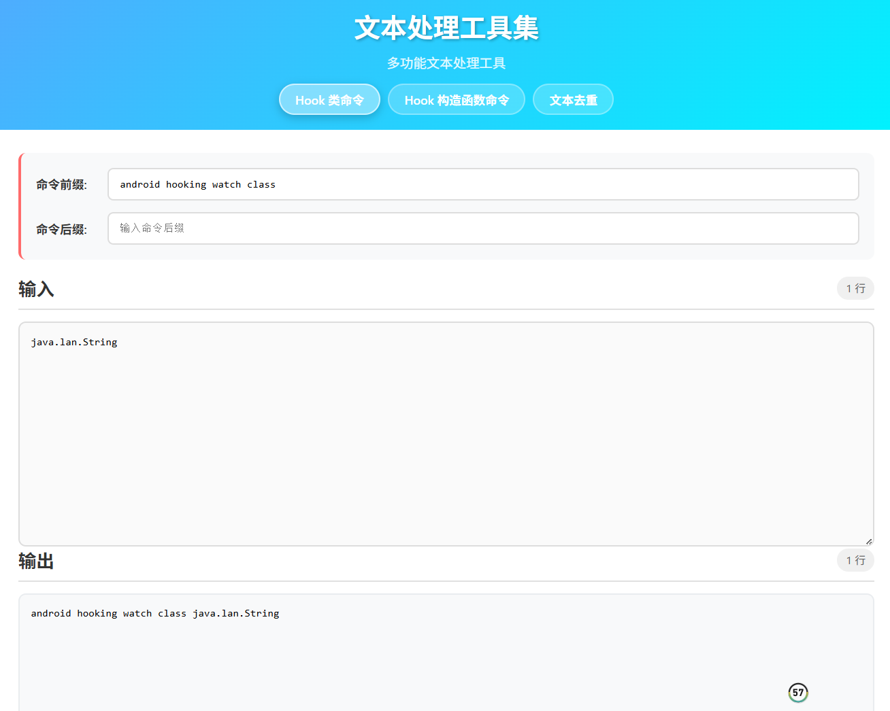
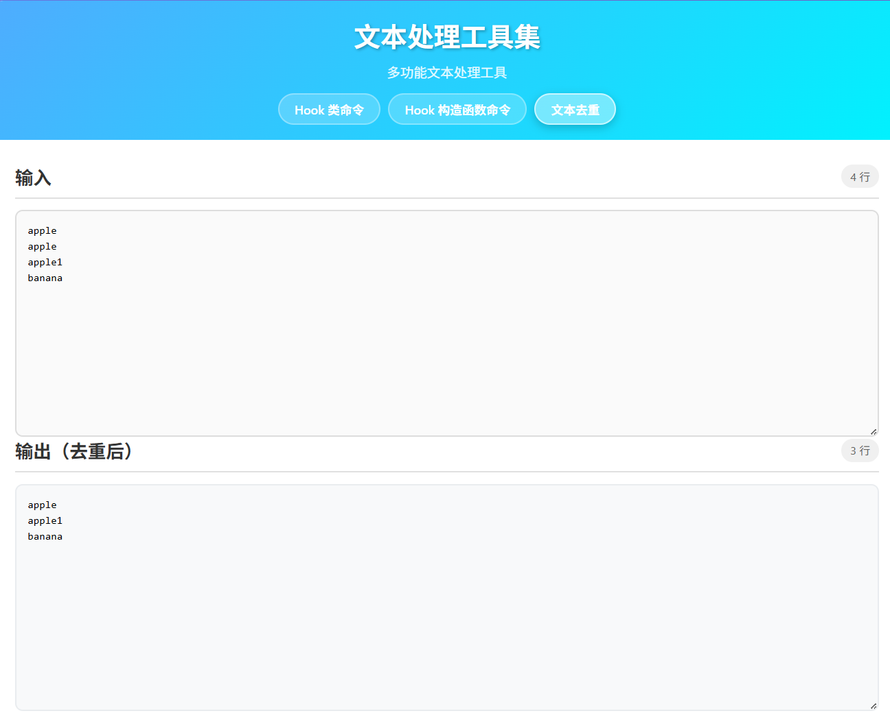

# 目前的工具


##  1. 批量Demangle处理脚本demangle_exports.py

使用方法：

    demangle文件夹下，

    python demangle_exports.py exports.json


<br>
exports.json是  objection

```
memory list exports libmynativeapplication1.so --json exports.json
```

的结果

<br>

效果如下：


<br><br>

##  2. hook指令处理工具集  android_hook_tool.html

使用方法：

    hook_tools文件夹下，

    打开android_hook_tool.html文件，即可使用    

<br>
效果如下：
<br><br>

Hook类指令


<br><br>

去重


<br><br>

## 3. RPC +Socket自吐+在电脑端输出抓包内容  hook_receive_socket.py


使用方法：

    socket 文件夹下，运行
    python hook_receive_socket.py
    Roysue_socket_send.js和hook_receive_socket.py配合使用

<br>
效果如下：

